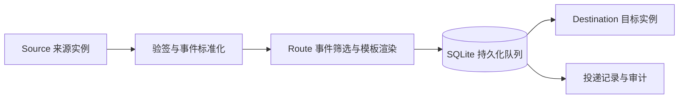

# Webhook Relay

[](https://github.com/FooFishes/webhook-relay/actions/workflows/ci.yml)

自托管的 Webhook 通知转发服务。接收来源平台的事件，使用完整的事件预设生成消息，再通过持久化队列发送到目标平台。

当前支持 **Apple App Store Connect → 飞书**，内置 13 类事件的完整消息模板。创建来源、目标和转发规则后即可使用；需要调整时，可以在控制台按事件编辑内容、插入变量、选择展示样式并预览。

**[快速开始](#快速开始) · [事件与模板](#事件与模板) · [本地开发](#本地开发) · [管理 API](docs/api.md) · [架构](docs/architecture.md)**



## 功能

- **完整事件预设**：每个已支持事件都有独立的内容、字段映射和默认展示方式，同时提供 Apple → 飞书的组合预设。
- **可视化自定义**：修改标题和内容块，点选变量，调整顺序；切换消息卡片、富文本或纯文本，选择正文、并排字段、辅助说明和链接按钮。
- **多来源、多目标**：同一平台可建立多个实例；一个来源通过多条规则分发到多个目标，每条规则独立筛选事件和生成投递任务。
- **持久化投递**：事件去重、事务入队、自动重试、手动重试和重启恢复；保留每次发送的结果。
- **运行控制台**：浅色与深色主题、运行概览、配置管理、接收与投递记录、关联筛选、审计查询。
- **密钥保护**：凭据单独管理并加密存储，已有值不会通过管理 API 回显；原始事件和投递快照也加密保存。

Rust 服务同时提供 WebUI、管理 API、Webhook 接收端和后台投递任务。生产运行只需一个服务实例和 SQLite，无需 Redis、外部消息队列或 Node.js 服务。

## 快速开始

```bash
git clone https://github.com/FooFishes/webhook-relay.git
cd webhook-relay
```

### Docker Compose

需要 Docker Compose 和 Python 3。镜像构建会安装前端依赖并编译 Rust 服务。

```bash
# 仅首次运行：生成随机管理令牌与加密主密钥
python3 scripts/init_env.py

# 部署到公网前，编辑 .env 中的 RELAY_PUBLIC_URL
# 例如：RELAY_PUBLIC_URL=https://relay.example.com
docker compose up -d --build --wait

# 检查服务状态
curl --fail http://127.0.0.1:8080/healthz
docker compose logs --tail=100 relay
```

访问 [http://localhost:8080](http://localhost:8080)，使用 `.env` 中的 `RELAY_ADMIN_TOKEN` 登录。管理令牌只保存在当前页面内存中，刷新后需要重新登录。

Compose 默认仅将服务发布到宿主机的 `127.0.0.1:8080`。公网部署需通过反向代理提供 HTTPS，并将 `RELAY_PUBLIC_URL` 设置为实际访问地址，用于生成 Webhook 回调链接。若反向代理也在容器中，需按容器网络调整上游地址。

数据保存在 `relay-data` 命名卷。容器以非 root 用户运行，使用只读根文件系统和可写数据卷。服务仅支持单实例使用一个数据库文件。

### 接通 Apple → 飞书

1. 在控制台的「密钥」中添加 Apple Webhook Secret、完整的飞书机器人 Webhook URL，以及可选的飞书签名密钥。
2. 在「来源」中创建 App Store Connect 实例，选择验签密钥，复制生成的回调地址：`https://你的域名/hooks/{source_id}`。
3. 在「通知目标」中创建飞书实例，选择机器人 URL；如机器人启用了签名校验，同时选择签名密钥。
4. 在「转发规则」中关联来源和目标，选择全部或指定事件，保存启用。**默认已具备完整模板，无需逐个创建。**
5. 在 App Store Connect 配置 Webhook，填写回调地址和相同的 Secret，订阅所需事件并发起连接测试。
6. 在「接收记录」确认事件到达，在「投递记录」确认飞书发送结果。Webhook 返回 `202` 表示事件已持久化，最终是否发送成功以投递记录为准。

如飞书启用了关键词或 IP 白名单校验，需让消息包含配置的关键词，并允许 Relay 服务器的出口 IP。平台操作说明见 [Apple Webhook 文档](https://developer.apple.com/documentation/appstoreconnectapi/configuring-webhook-notifications)与[飞书自定义机器人文档](https://open.feishu.cn/document/client-docs/bot-v3/add-custom-bot)。

## 事件与模板

### 当前支持的事件

下表是本项目已实现的 App Store Connect 事件目录。每种事件都有对应的示例数据、字段定义和完整消息预设。

| 分类       | 事件                                                           |
| ---------- | -------------------------------------------------------------- |
| 应用发布   | App 版本状态变更、构建上传状态变更                             |
| TestFlight | 构建状态变更、截图反馈、崩溃反馈                               |
| 后台资源   | 版本状态变更、内部测试发布、外部测试状态变更、商店发布状态变更 |
| 替代分发   | 分发包版本创建、分发包可用性变更、地区可用性变更               |
| 连接测试   | 连通性测试                                                     |

完整事件标识和示例见 [Apple 事件目录](src/providers/apple_events.json)。规则筛选使用收到的 `data.type`，例如 `appStoreVersionAppVersionStateUpdated`。

### 默认内容与展示方式

模板由四部分依次组合：

| 层次                          | 职责                                                                      |
| ----------------------------- | ------------------------------------------------------------------------- |
| Source 事件模板               | 提供该事件的标题、内容块、字段取值和操作链接                              |
| Destination 默认样式          | 将内容转换为目标平台支持的消息格式                                        |
| Source → Destination 组合预设 | 为特定平台组合提供完整的内容与布局，目前覆盖 Apple → 飞书的全部 13 个事件 |
| 规则中的事件自定义            | 仅覆盖需要调整的事件和展示配置，其余继续使用预设                          |

因此，未进行自定义的事件也能直接发送完整消息。没有匹配的组合预设时，使用 Source 的默认事件内容和 Destination 的默认展示方式。未知事件会保留接收记录，但不会为使用内置事件模板的规则创建投递任务。

### 在控制台中调整

- **消息模板**：浏览事件目录、查看消息和尝试编辑。这里的修改仅用于预览。
- **转发规则 → 消息模板**：修改当前规则的事件内容；保存规则后生效，可以单独恢复某个事件的内置预设。
- **消息内容**：编辑标题、文本和链接，插入当前事件的变量，调整内容块顺序及局部样式。
- **消息样式**：切换飞书消息卡片、富文本或纯文本。切换时保留内容，局部卡片样式只在卡片模式下生效。
- **事件字段**：查看字段路径和示例值。内置模板会省略缺失的可选字段，布尔值 `false` 仍正常展示。

预览使用与实际接收相同的服务端渲染逻辑，不发送通知；控制台展示内容结构，最终排版以飞书客户端为准。

通过 API 创建规则时，可以省略消息配置，或明确使用推荐预设：

```json
{
  "message_policy": {
    "preset": "recommended",
    "overrides": {}
  }
}
```

这是规则配置中的消息部分。字段约束、自定义覆盖和完整资源请求见 [管理 API](docs/api.md)。

### 已有规则兼容

旧版 `event_templates` 和 `payload_template` 配置继续生效，不会自动覆盖已有内容。控制台可将旧规则切换为完整内置预设，保存后替换原消息配置。三种消息配置互斥。

旧版原生消息编辑器仍支持图片、群名片和扩展平台字段；图片与群名片需要已有的 `image_key` / `share_chat_id`。当前项目不提供图片上传或群信息查询。

## 本地开发

需要 Rust 稳定版、Node.js 24、Corepack 和 Python 3。前端包管理器版本由 `web/package.json` 声明；依赖由 `Cargo.lock` 与 `web/pnpm-lock.yaml` 锁定。

先在项目根目录安装前端依赖：

```bash
corepack enable
pnpm --dir web install --frozen-lockfile
```

### 运行完整控制台

```bash
# 仅首次运行；已有 .env 时跳过
python3 scripts/init_env.py

# Rust 程序不会自动加载 .env
set -a
. ./.env
set +a

pnpm --dir web build
cargo run --locked
```

访问 [http://localhost:8080](http://localhost:8080)。若需要前端热更新，保持 Rust 服务运行，在另一个终端执行：

```bash
pnpm --dir web dev
```

访问 Vite 输出的地址。开发服务器将 `/api` 代理到 `http://127.0.0.1:8080`；Webhook 请求仍发送到 Rust 服务端口。

### 只预览模板界面

安装前端依赖后，可以直接启动隔离的预览环境，无需初始化 `.env` 或准备平台凭据：

```bash
cargo build --locked
python3 scripts/preview_templates.py
```

打开 [http://127.0.0.1:5196](http://127.0.0.1:5196)。脚本使用临时数据库、随机凭据和 `127.0.0.1:8096` 后端，读取真实事件目录并执行服务端渲染；资源写入和发送相关 API 被禁用，其他管理页面不作为完整服务运行。退出脚本后会清理临时环境。

## 配置与数据

| 环境变量            | 用途                      | 默认值或要求                                  |
| ------------------- | ------------------------- | --------------------------------------------- |
| `RELAY_ADMIN_TOKEN` | 管理 API 与控制台登录令牌 | 必填，至少 32 字节；初始化脚本随机生成        |
| `RELAY_MASTER_KEY`  | 加密密钥、事件和任务快照  | 必填，Base64 编码的 32 字节随机密钥           |
| `RELAY_PUBLIC_URL`  | 回调链接的公开地址        | `http://localhost:8080`                       |
| `RELAY_BIND`        | 服务监听地址              | `127.0.0.1:8080`；Compose 中为 `0.0.0.0:8080` |
| `DATABASE_URL`      | SQLite 连接地址           | `sqlite://data/relay.db`；Compose 使用数据卷  |
| `RELAY_WEB_DIR`     | 前端构建产物目录          | `web/dist`                                    |
| `RUST_LOG`          | 日志过滤级别              | `webhook_relay=info`                          |

初始化脚本以 `0600` 权限创建 `.env`，不会覆盖已有文件。`.env.example` 仅用于说明配置结构，应使用初始化脚本生成实际凭据。

**数据库和 `RELAY_MASTER_KEY` 必须同时备份，并分开保管。** 直接更换主密钥会使已有密钥、事件和任务快照无法解密。更换管理员令牌只需修改 `RELAY_ADMIN_TOKEN` 并重启；平台业务密钥可在控制台中更新。

SQLite 使用 WAL。在线备份应使用 SQLite backup API 或 `.backup`，不要只复制正在运行的 `.db` 文件；也可以停止服务后备份数据卷。历史记录不会自动清理，需要关注磁盘用量。

## 投递与配置生效

- **接收与去重**：验签通过后按来源和事件 ID 去重。首次接收并事务保存事件与任务后返回 `202`；重复且正文相同返回 `200`，相同 ID 但正文不同返回 `409`。
- **独立投递**：每条匹配规则生成独立任务，某条规则的渲染失败不会阻止其他规则。没有匹配规则时仍保留事件。
- **配置快照**：任务保存接收时的消息和目标快照。修改模板、URL 或密钥仅影响新事件；手动重试仍使用原快照。停用规则或目标会暂停相应待处理任务，已开始的网络请求可能完成。
- **成功判断与重试**：同时检查 HTTP 状态与飞书业务码。网络错误、5xx、429 和识别到的限流错误会按退避策略重试；其他业务错误标记失败，可查看原因后手动重试。
- **至少一次投递**：如果远端已收到消息，但 Relay 在记录结果前中断，恢复后可能再次发送。发送中断的尝试记为 `unknown`，恢复过程写入审计。

## 验证

[GitHub Actions](https://github.com/FooFishes/webhook-relay/actions/workflows/ci.yml)执行格式检查、静态分析、构建、Rust / 前端测试与隔离 HTTP 回归，并上传 HTTP 验证报告。

```bash
cargo fmt --check
cargo clippy --locked --all-targets -- -D warnings
cargo test --locked

pnpm --dir web format:check
pnpm --dir web build
pnpm --dir web test

cargo build --locked
python3 scripts/verify_http.py
```

HTTP 回归使用真实 Rust 进程、临时 SQLite 和本地飞书模拟服务，覆盖验签、去重、事件模板、重试、重启恢复和审计，不连接真实 Apple 或飞书，也不修改正式数据库。报告生成在被 Git 忽略的 `reports/` 目录。

Docker 冒烟验证：

```bash
docker build -t webhook-relay:verify .
python3 scripts/verify_docker.py
```

脚本创建临时容器和数据卷，检查启动、权限、鉴权及重启持久化，结束后清理测试资源。

## 当前范围

- 当前适配器为 App Store Connect 来源和飞书目标；平台接口、消息格式和字段描述由适配器提供，可通过 Rust trait 扩展。
- TestFlight 反馈事件只转发 Webhook 自身携带的信息。尚未调用 App Store Connect API 补充反馈正文、截图或崩溃日志。
- 不支持 App Store Server Notifications V2 的订阅、退款和内购 `signedPayload` 协议。
- 使用单个管理员令牌，尚无多用户账号、角色权限或自动历史归档。
- 当前采用单实例 SQLite 和全局发送间隔至少 750ms，适用于轻量通知转发；不支持多副本共享数据库或高吞吐量任务分发。

## 技术与扩展

后端使用 **Rust、Axum、Tokio、SQLx、SQLite、Reqwest / Rustls、MiniJinja**；前端使用 **React、TypeScript、Vite、Kumo、Tailwind CSS、TanStack Query**。

| 目录                                                         | 内容                                                                                        |
| ------------------------------------------------------------ | ------------------------------------------------------------------------------------------- |
| [`src/providers/`](src/providers/)                           | 来源与目标适配器、事件目录、消息渲染和内置预设                                              |
| [`src/api.rs`](src/api.rs)、[`src/worker.rs`](src/worker.rs) | 管理 API、Webhook 接收与后台投递                                                            |
| [`web/src/`](web/src/)                                       | 控制台、模板工作区和平台消息编辑器                                                          |
| [`migrations/`](migrations/)                                 | 数据库迁移                                                                                  |
| [`tests/`](tests/)、[`scripts/`](scripts/)                   | 协议测试、HTTP / Docker 验证、本地预览与初始化                                              |
| [`docs/`](docs/)                                             | [架构](docs/architecture.md)、[管理 API](docs/api.md)、[早期验证记录](docs/verification.md) |

新增来源时，在适配器中定义验签、事件标准化、事件目录与默认内容；新增目标时，定义消息样式、渲染、凭据和发送结果分类，再注册到 [`registry.rs`](src/providers/registry.rs)。详细职责见 [架构文档](docs/architecture.md)。

问题反馈和改进建议可以提交到 [Issues](https://github.com/FooFishes/webhook-relay/issues)。涉及实现的修改，请附上相关验证结果；平台联调结果请区分模拟服务与真实消息投递。
