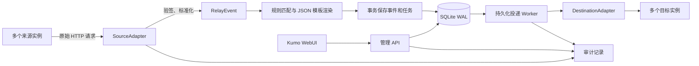

# 架构与扩展

## 分层

API、密钥服务、数据库操作、Provider 协议和 Worker 分开管理：

| 文件 | 职责 |
| --- | --- |
| `src/main.rs` | 环境变量、数据库、HTTP 客户端与任务生命周期 |
| `src/api.rs` | 管理端鉴权、配置接口、Webhook 接收、查询与审计入口 |
| `src/config.rs` | Provider 类型、配置字段、引用和业务约束校验 |
| `src/model.rs` | 资源、标准事件、投递快照 |
| `src/crypto.rs` | 主密钥解析、随机 nonce 的 AES-GCM 加解密 |
| `src/store.rs` | SQLx 数据库池、资源访问、审计写入与密钥读取 |
| `src/providers/` | 来源验签、事件标准化、目标消息准备与模板处理 |
| `src/worker.rs` | 任务选择、限速、HTTP 投递、重试、恢复及结果落库 |
| `web/src/` | React + Kumo 控制台与管理 API 客户端 |

## 抽象边界

`SourceAdapter` 提供平台描述、凭据字段、事件选项及预览示例，负责当前平台的原始请求验签和事件标准化。来源适配器不直接发送目标通知，不持有数据库连接。

`DestinationAdapter` 负责消息基本结构校验和发送前签名。Worker 处理 HTTP 和队列状态。适配器同时负责目标 URL 校验、响应业务码解释及是否重试的判定。Worker 按任务快照中的 provider 选择适配器，不固定调用飞书。

事件内容与目标协议独立：Source 在事件目录里提供完整的 `content_template`，Destination 通过 `render_content` 将标题和内容块转换为自身消息格式。`providers/message.rs` 依次解析 Source 默认内容、Destination 默认展示、平台组合完整预设、当前规则的事件覆盖，再填充真实事件字段并交给目标适配器。`presets/apple_feishu_designs.json` 保存 13 个 Apple → 飞书完整预设，包含内容及展示配置。规则不保存模板时同样使用此路径；旧的原生 JSON 模板路径保持兼容。

控制台的 `TemplateLibrary` 提供成品模板目录，`MessageStudio` 提供事件切换、内容编辑、变量插入、局部样式弹出面板及服务端实时预览。编辑只保存当前规则的覆盖，恢复默认只需删除该事件覆盖。预览样例不代表调用了 Apple API 补充数据，模板不虚构 Webhook 中没有的版本号、截图或反馈正文。

`RelayEvent` 提供统一字段及 `raw`，使模板能使用通用摘要，也能读取 Provider 专属字段。首版不自动补查 Apple API，避免把 Webhook 验签密钥与 App Store Connect `.p8` API 凭证混为一谈。

WebUI 通过专用表单和递归字段表单编辑消息，不直接编辑原始 JSON；预览与审计详情允许展示 JSON。运行概览使用服务端只读事务聚合完整数据库，并提供规则、事件与任务的关联查询。

`providers/registry.rs` 是已实现适配器的注册入口，`/api/meta` 返回来源与目标适配器列表。平台字段、事件选项、预览示例和默认消息保存在各适配器中。前端 `providers/feishu/` 保存飞书消息编辑与预览组件，通用资源页面只按描述和编辑器标识分派。

资源配置以经过服务端验证的 JSON 保存。来源与目标的允许字段由适配器声明，当前支持对密钥资源的引用；未知配置会被拒绝。每个资源具有 `revision`，更新必须匹配旧版本，避免两个编辑页面相互覆盖。

## 数据模型

平台类型（Provider）与实例（Source / Destination）分开：
同一适配器可以用于多个实例；每条 Route 连接一个 Source 和一个 Destination。多条 Route 共同组成多来源、多目标关系，例如来源 A → 目标 X、来源 A → 目标 Y、来源 B → 目标 X。每条规则独立配置消息、重试次数和启用状态。

已有实例不能更换 provider，避免用新协议重新解释历史配置。新建不同平台的实例后，可以调整规则；当目标平台改变时，WebUI 要求确认并重置消息格式。现有任务继续使用旧快照。

- `resources`：Key、Source、Destination、Route。应用层验证引用；删除前检查反向引用和未完成投递。
- `events`：来源、平台事件 ID、事件类型、正文摘要、加密原始正文。唯一约束为 `(source_id, provider_id)`。
- `deliveries`：每条匹配规则对应一个任务，唯一约束为 `(event_id, route_id)`。provider、消息内容、目标 URL 和签名密钥共同加密保存为快照。旧快照缺少 provider 时按原有飞书任务读取；显式但未注册的 provider 不回退到其他适配器。
- `attempts`：每次网络发送尝试及 HTTP / 平台状态码，不存上游响应原文。
- `audit`：只追加的操作元数据与结果。数据库触发器禁止普通 SQL 更新和删除。
- `vault_metadata`：加密的主密钥校验标记，使所有业务密钥被删除后仍能检查主密钥是否正确。

配置写入与接收处理使用进程内锁，让同一进程中的验证、读取与变更保持一致。启动时通过数据库旁的文件锁阻止重复进程（即使使用不同监听端口）。此实现明确用于单实例；水平扩容时应更换数据库并实现跨进程原子任务认领和租约，不应仅复制容器。

## 事务边界

1. 收到请求后读取来源和密钥，按原始字节验证签名。
2. 解析与标准化，查重并匹配启用的规则与目标。
3. 每个匹配规则独立渲染；某条模板失败时为其建立失败任务，其他规则仍可正常入队。
4. 一个事务保存事件、所有任务和接收/入队审计，提交后才返回成功。
5. Worker 发送前先事务保存 `sending` 尝试和审计；收到结果后再事务更新任务、尝试与结果审计。

网络调用无法和 SQLite 事务原子提交，因此不承诺严格一次投递。若发送阶段中断，原尝试标记 `unknown`，任务恢复为 `retrying`。已到达远端的请求可能被再次发送。

## 安全与运行边界

- 管理端使用长随机 Bearer Token，恒定时间比较其 SHA-256 摘要；不使用 Cookie，不开启跨域管理接口。
- 公网请求使用 TLS；本服务由外部反向代理终止 TLS。反向代理应设置适合部署规模的请求速率、连接数和日志策略。
- API 不返回已有密钥；浏览器不持久化管理员令牌。用户主动输入的 Key 值只在提交时发送，关闭表单后清空。
- 生产目标仅允许 `https://open.feishu.cn/open-apis/bot/v2/hook/...`，禁止凭据、query、fragment 和重定向，不支持任意 HTTP 地址。
- `RELAY_TEST_FEISHU_ORIGIN` 仅用于回归测试，必须是精确 `http://127.0.0.1:PORT`，不应在生产设置。
- 全局请求体与模板限制 256 KiB，飞书适配器另行限制消息为 20 KB、模板渲染使用 fuel 和输出大小限制。入站事件仍应视为业务数据，不能当成代码执行。
- HTTP 连接超时 5 秒、总超时 15 秒、响应正文限制 64 KiB。
- 控制台带有 CSP、禁止嵌入、MIME 嗅探防护和禁止缓存响应头。
- 审计不具备抵抗数据库管理员篡改的能力；多人身份、WORM 存储、外部归档和留存策略需要独立设计。

## 新 Provider 的实施顺序

1. 在 `src/providers/` 实现适配器，并声明平台名称、配置字段、默认值；来源提供事件选项与示例，目标提供默认模板与编辑器标识。
2. 在 `registry.rs` 注册适配器。配置校验、实例创建、接收分派、模板校验、快照投递和响应分类通过注册入口选择适配器。
3. 新目标在 `web/src/providers/<provider>/` 实现消息编辑器及内容预览，并注册到通用组件的映射中。来源的密钥引用字段、事件选项和示例由元数据驱动，无需写入通用页面。
4. 校验目标 URL 白名单、消息限制、响应分类和重试语义。当前发送器提供 HTTP POST JSON；需要不同 HTTP 方法、鉴权头或独立调度策略的平台，应扩展相应发送接口。
5. 使用官方协议样例和独立 HTTP 模拟服务验证，包括多个来源的去重隔离、多目标分发及单目标失败隔离。

当前注册表只包含已实现的平台。扩展通过源码修改并重新编译，不是运行时安装插件。
